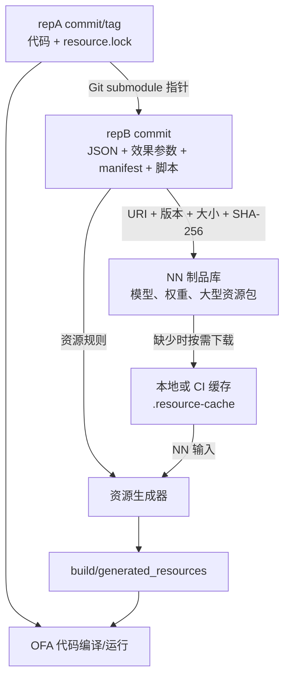

# OFA 代码与 NN 资源分离管理——技术设计与可行性评审

> 文档状态：PoC 已验证，正式方案待组内评审  
> 最后更新：2026-09-16  
> 代码仓库：<https://github.com/abLiuMing/code_rep>  
> 资源配置仓库：<https://github.com/abLiuMing/res_rep>

## 1. 文档目的

本文用于帮助开发、算法、效果、构建、CI/CD 和发布人员共同评审以下问题：

- 当前方案是否满足“代码与资源分仓”的原始要求；
- repA、repB、NN 制品库和本地缓存之间是什么关系；
- 为什么采用小型 submodule，而不是把 15GB 资源全部放进 Git；
- 代码分支、资源配置版本和 NN 版本如何精确对应；
- 开发人员日常如何切换、修改、构建和运行；
- Ubuntu、Windows、macOS 是否可用；
- 当前 PoC 已验证了什么，尚未验证什么；
- 正式接入时有哪些风险、优化点和待决策事项。

本文不把 PoC 当成最终生产实现。文中会明确标注“当前已实现”和“正式方案建议”。

## 2. 背景

原有 OFA 仓库同时保存：

- CV/算法代码；
- NN 模型与权重；
- 效果参数；
- JSON 等配置文件；
- 可能由资源转换过程生成的平台文件。

随着项目、平台、算法和 NN 版本增加，资源总量已经超过 15GB。继续放在同一个 Git 仓库会带来：

1. 所有开发者都承担大仓库 clone、fetch 和磁盘成本；
2. 删除最新分支中的模型并不会删除 Git 历史中的大对象；
3. 模型与参数提交淹没代码 Git Log；
4. 只修改代码的开发者仍需要处理大量资源；
5. 项目、平台、算法和 NN 版本关系难以追踪；
6. 同一代码版本可能在不同时间取到不同资源；
7. CI 重复下载和构建，影响时效与稳定性；
8. Windows、Ubuntu、macOS 的资源准备方式可能不一致。

## 3. 原始需求与方案符合性

| 原始需求 | 当前方案 | 符合情况 |
| --- | --- | --- |
| repA 为代码仓，repB 为资源仓，单向依赖 | repA 通过 submodule 依赖 repB，repB 不依赖 repA | 符合 |
| 在 repA 中可以修改 repB 的资源配置 | `deps/resource_config` 是独立 repB 工作区，可建分支、提交、推送 | 符合 |
| repA 切分支时 repB 切换对应版本 | `tools/ofa switch` 切 repA 后执行 submodule update，恢复精确 commit | 符合 |
| Build/Run 前准备并生成资源 | `prepare/build/run` 已串联下载、校验、生成和运行 | PoC 符合 |
| 项目、平台、算法、NN 版本可对应 | repA lock 选择 manifest，manifest 描述算法、平台和 NN | PoC 已实现基础字段 |
| 大资源不拖慢普通代码仓 | NN 不进入 repA/repB 主分支，按需下载和缓存 | 符合 |
| 资源版本可复现 | repA 锁 repB commit，repB manifest 锁 NN 路径和 SHA-256 | 符合 |
| Ubuntu、Windows、macOS 可运行 | Shell + PowerShell 双入口，GitHub Actions 三平台通过 | 符合 PoC 范围 |
| 尽量少依赖额外工具 | Ubuntu/macOS 使用系统 Shell，Windows 使用 PowerShell | 符合 |
| 支持15GB正式资源 | 架构支持，但尚未接入正式制品库和真实15GB资源 | 尚待完成 |

结论：核心架构满足原始方向，PoC 已验证主要控制链路；正式使用仍依赖制品库、权限、真实构建系统和资源迁移方案落地。

## 4. 总体设计

推荐结构由四部分组成：

| 组件 | 物理位置 | 保存内容 | 责任 |
| --- | --- | --- | --- |
| repA-code | Git 仓库 | 代码、resource lock、统一工具、CI | 决定使用哪套资源 |
| repB-res | Git 仓库/submodule | JSON、效果参数、manifest、Schema、资源脚本 | 定义一套资源由什么组成 |
| 制品库 | 专业制品服务或对象存储 | NN、权重、大型二进制、可选的预生成资源包 | 保存和分发大文件 |
| 本地/CI 缓存 | 开发机或 runner | 已下载 NN 和可选生成缓存 | 避免重复下载和生成 |



完整版本链：

```text
repA commit/tag
  └─ 锁定 repB commit
       └─ 选择 manifest
            ├─ JSON/效果参数来自该 repB commit
            └─ NN 由制品 URI + version + size + SHA-256 锁定
```

只要 repA commit、repB commit 和制品不可变，就可以重建同一套输入。

## 5. 为什么制品库不是第三个 Git 仓库

制品库通常是面向大型二进制的版本化文件服务，不使用 `git clone`、`git checkout` 和 `git commit`。它通常使用 HTTP API、CLI 或 CI 插件上传、下载。

可选产品包括：

- JFrog Artifactory；
- Sonatype Nexus；
- GitLab Generic Package Registry；
- MinIO/S3 对象存储；
- 公司内部制品平台；
- 具备鉴权、不可覆盖、校验和保留策略的 HTTP 文件服务。

Git 和制品库的职责不同：

| 能力 | Git | 制品库 |
| --- | --- | --- |
| 文本 diff、review、merge | 擅长 | 不擅长 |
| commit、tag、分支 | 原生支持 | 通常不提供 Git 语义 |
| 500MB～15GB 二进制 | 不适合普通 Git | 专门面向大文件 |
| 单文件按版本下载 | 不够直接 | 擅长 |
| CDN、断点续传、流量统计 | 一般 | 通常更合适 |
| 版本保留和清理 | 删除历史困难 | 可配置保留策略 |
| 制品不可覆盖 | 依赖流程约定 | 通常可配置 |

当前 PoC 为避免依赖公司基础设施，暂时使用 `res_rep/demo-artifacts` 分支和 GitHub Raw 模拟制品服务，仅保存 1MiB/2MiB 测试文件。该方式只用于验证在线下载链路，不适合真实15GB资源。

## 6. repA 设计

当前结构：

```text
code_rep/
├── .github/workflows/cross-platform.yml
├── .gitattributes
├── .gitmodules
├── resource.lock
├── tools/
│   ├── ofa                 # Ubuntu/macOS Shell入口
│   ├── ofa.ps1             # Windows PowerShell入口
│   └── ofa.cmd             # Windows CMD包装入口
├── src/
│   ├── main.sh
│   └── main.ps1
├── deps/
│   └── resource_config/    # repB submodule
├── .resource-cache/        # 本地缓存，Git ignore
└── build/                  # 生成输出，Git ignore
```

### 6.1 resource.lock

PoC 示例：

```text
manifest=Q2-8850.tsv
```

repA 不直接记录“永远取 repB main 最新资源”，而是通过 submodule 指针记录一个确定 repB commit。`resource.lock` 再选择该 commit 中的一个 manifest。

正式格式建议升级为 YAML 或 JSON：

```yaml
schema_version: 1
project: Q2
platform: "8850"
manifest: manifests/Q2/8850/2.33.yaml
```

不建议把 repB commit 重复写进 lock，因为 Git submodule 已经保存该 commit；重复字段可能产生两个来源不一致的问题。

### 6.2 统一工具命令

| 命令 | 功能 |
| --- | --- |
| `sync` | 初始化/恢复 repB 到 repA 锁定 commit |
| `prepare` | 读取 manifest、检查缓存、下载和校验 NN |
| `build` | prepare 后生成平台资源 |
| `run` | build 后运行当前 PoC/实际程序 |
| `switch <branch>` | 切换 repA 后同步 repB |
| `status` | 查看 repA 状态和 repB commit |

Build 只消费已经锁定的资源，不执行 `git submodule update --remote --merge`，也不追踪远端最新 NN。

## 7. repB 设计

当前结构：

```text
res_rep/
├── configs/
│   └── effect.json
├── manifests/
│   ├── Q2-8850.tsv
│   └── Q3-8870.tsv
├── scripts/
│   ├── build_resources.sh
│   └── build_resources.ps1
├── .gitattributes
└── README.md
```

正式建议扩展为：

```text
res_rep/
├── configs/
│   ├── common/
│   ├── srainr/Q2/8850/
│   ├── hdrhdsr/Q2/8850/
│   └── se/Q2/8850/
├── manifests/
│   ├── Q2/8850/2.33.yaml
│   └── Q3/8870/3.00.yaml
├── schemas/
│   ├── manifest.schema.json
│   └── effect.schema.json
└── scripts/
```

适合放 repB Git：

- JSON/YAML/XML 等文本配置；
- 效果参数；
- 公共参数；
- manifest；
- Schema 和校验规则；
- 下载、转换、校验和打包脚本；
- 小型、需要 diff/review 的资源。

不适合放 repB 主分支：

- 数百 MB 的 NN/权重；
- 大量历史二进制；
- 可以重新生成的中间文件；
- 各平台构建输出。

## 8. Manifest 设计

PoC 为减少依赖使用 TSV：

```text
# name version artifact sha256
srainr 2.33 srainr/Q2/8850/2.33/model.bin <sha256>
```

正式方案需要表达更多信息，建议使用带 Schema 的 YAML/JSON：

```yaml
schema_version: 1
release:
  name: Q2-8850-2.33
  project: Q2
  platform: "8850"

resources:
  - name: srainr
    version: "2.33"
    artifact:
      uri: artifact://ofa-nn/srainr/Q2/8850/2.33/model.bin
      size: 524288000
      sha256: 25037ef674423965787002cb780c972cec3e9202f97152381486750af5a7c841
    configs:
      - configs/common/color.json
      - configs/srainr/Q2/8850/effect.json
```

正式 manifest 至少应包含：

- schema version；
- 项目和平台；
- 算法/资源名称；
- NN 版本；
- 制品 URI；
- 文件大小；
- SHA-256；
- 关联 JSON/效果参数；
- 可选依赖和生成器版本。

## 9. 分支与版本策略

不建议为每个算法、平台、NN 版本建立长期 repB 分支：

```text
srainr/Q2/8850/2.33
hdrhdsr/Q2/8850/2.33
se/Q2/8850/2.33
```

原因：一个 submodule 工作目录同一时间只能 checkout 一个分支，而一个 OFA 构建可能同时需要多个算法资源。

推荐：

- 分支用于开发和评审，例如 `feature/update-srainr-2.34`；
- 正式版本通过目录、manifest、repB commit 和制品版本表达；
- feature 分支合入后可以删除，正式资源仍可由 commit 和 manifest 恢复。

PoC 为演示分支联动，保留：

| repA 分支 | manifest | 项目/平台 | NN |
| --- | --- | --- | --- |
| `main` | `Q2-8850.tsv` | Q2/8850 | srainr 2.33 |
| `project-q3-8870` | `Q3-8870.tsv` | Q3/8870 | srainr 3.00 |

正式项目不要求 repA 和 repB 同名分支。关键是 repA 的每个 commit 锁定正确 repB commit。

## 10. 资源更新事务

### 10.1 只修改 JSON/效果参数

```text
在 repB 创建 feature 分支
→ 修改配置
→ Schema/语义校验
→ 本地 Build/Run
→ repB PR 评审并合入
→ repA 更新 submodule 指针
→ repA Build/Run
→ repA PR 评审并合入
```

### 10.2 更新 NN

```text
生成新 NN
→ 上传制品库新版本路径
→ 获取 size + SHA-256
→ 更新 repB manifest/相关参数
→ repB PR 评审并合入
→ repA 更新 submodule 指针/lock
→ CI 下载、校验、生成、编译、测试
→ repA PR 合入
```

必须遵循“repB 先可达，repA 后引用”。否则 repA 可能引用一个其他人无法 fetch 的 repB commit。

不建议一条脚本自动 commit/push 两个仓库。工具可以完成检查和准备，但 push 应保持显式，因为跨仓操作不具备天然原子性。

## 11. NN 制品规则

已经发布的制品路径必须不可覆盖。例如：

```text
srainr/Q2/8850/2.33/model.bin
```

NN 改变后发布新版本：

```text
srainr/Q2/8850/2.34/model.bin
```

不可覆盖的原因：

- 旧 repA tag 必须仍能恢复旧模型；
- manifest 的 SHA-256 必须长期稳定；
- CI 缓存以内容标识为依据；
- 问题回溯需要知道实际运行的模型。

上传建议流程：

1. 上传临时路径；
2. 服务端或客户端校验大小/SHA-256；
3. 完成后发布到不可变版本路径；
4. 生成 manifest；
5. 禁止普通用户覆盖或删除正式制品。

## 12. 本地缓存设计

PoC 缓存位于：

```text
.resource-cache/<artifact-relative-path>
```

正式建议使用内容寻址：

```text
.resource-cache/
└── sha256/
    └── 25037ef67442.../
        └── model.bin
```

内容寻址的优点：

- 相同 NN 被多个项目复用时只保存一份；
- 名称或版本号相同但内容不同会被检测；
- 下载完成前可以安全写临时文件；
- 缓存索引容易统计和清理。

推荐增加：

- 最大容量，例如 30GB；
- LRU 清理；
- 最近使用时间；
- 并发文件锁，防止两个 Build 同时下载同一文件；
- 成功校验标记，避免每次对大文件重复计算 SHA；
- `cache list/clean/verify` 命令。

## 13. 下载、校验与原子替换

资源不能直接覆盖当前可用文件。安全流程：

```text
下载到 model.bin.tmp
→ 校验大小
→ 校验 SHA-256
→ 移动到内容缓存
→ 生成到 generated_resources.new/
→ 全部成功后替换 generated_resources/
```

任何一步失败：

- 删除或保留可恢复的临时文件；
- 不覆盖上一套完整输出；
- 返回非零错误码；
- 输出资源名称、URI、期望/实际校验值；
- CI 立即失败。

PoC 已实现 SHA-256 检查和生成目录整体替换；正式版还应补充文件大小、重试、超时、断点续传和并发锁。

## 14. 公共参数和算法依赖

不同算法可能共享资源，例如 `snsc` 与 `ext_ref` 使用公共参数。不能依靠人工复制，否则容易出现多个版本。

建议 manifest 表达依赖：

```yaml
resources:
  common_color:
    version: "1.2"
    artifact: common/color/1.2/params.bin

  snsc:
    version: "2.3"
    depends_on: [common_color]

  ext_ref:
    version: "3.1"
    depends_on: [common_color]
```

需要形成参数覆盖规范，例如：

```text
平台默认参数 → 项目参数 → 算法参数 → 本地调试参数
```

构建时应输出最终来源清单，方便定位“某参数最终为什么是这个值”。

## 15. 跨平台实现

| 平台 | 入口 | 下载 | SHA-256 | 资源构建 |
| --- | --- | --- | --- | --- |
| Ubuntu | `./tools/ofa` | curl 或 wget | sha256sum | Shell |
| macOS | `./tools/ofa` | curl 或 wget | shasum | Shell |
| Windows PowerShell | `.\tools\ofa.ps1` | Invoke-WebRequest | Get-FileHash | PowerShell |
| Windows CMD | `tools\ofa.cmd` | 调用 PowerShell | Get-FileHash | PowerShell |

`.gitattributes` 固定 Shell、PowerShell、CMD 和配置文件的换行符，避免 CRLF/LF 导致脚本不可执行。

当前没有引入 Python、Node.js 或其他运行时。长期若命令和 manifest 复杂度明显增长，可以考虑 Go 单文件工具，以一套实现替代 Shell/PowerShell 双维护。

## 16. CI/CD 设计

当前 GitHub Actions 已在真实 runner 验证：

- Ubuntu；
- Windows；
- macOS；
- 当前分支运行；
- 切换 `main` 后运行；
- 切换 `project-q3-8870` 后运行；
- 在线 NN 下载、SHA-256 校验、缓存和资源生成。

工作流：<https://github.com/abLiuMing/code_rep/actions/workflows/cross-platform.yml>

正式 CI 建议：

```text
checkout repA + submodule
→ 校验 lock/manifest Schema
→ 检查制品权限与存在性
→ 恢复 CI 缓存
→ 下载缺少 NN
→ 校验 size + SHA-256
→ 生成资源
→ 编译 OFA
→ 单元/集成/效果测试
→ 发布代码产物和资源清单
```

缓存键建议：

```text
OS + platform + repB commit + manifest hash + generator version + build flags
```

首次 Actions 测试发现默认浅克隆只获取当前分支，无法执行跨分支测试，现已通过 `fetch-depth: 0` 修正。正式 CI 如果不需要切换其他分支，可以继续使用浅克隆降低时间。

## 17. 权限模型

| 角色 | repA | repB | 制品库 |
| --- | --- | --- | --- |
| 普通代码开发者 | 读写/PR | 只读 | 下载 |
| 算法/效果开发者 | 读写/PR | 读写/PR | 上传、下载 |
| CI 账号 | 只读 | 只读 | 下载，必要时上传构建产物 |
| 发布账号 | 受控写入 | 受控写入 | 发布正式不可变制品 |

当前 GitHub 仓库为公开 PoC，同事无需权限即可 clone、fork、在自己的 fork push 并提交 PR；直接 push 到 `abLiuMing` 仓库仍需要 Collaborator 权限。

正式凭证要求：

- Token/密码不得进入 Git、manifest 或日志；
- CI 凭证放 Secret；
- 下载和上传权限分离；
- 正式版本删除/覆盖权限只给发布账号；
- 操作应有审计记录。

## 18. 历史 tag 与迁移

旧 repA tag 同时包含代码和资源，不能直接修改 tag 或重写 commit。建议划定迁移分界线：

```text
旧版本：继续从原 repA 历史恢复资源
新版本：使用 repB + manifest + 制品库
```

如果旧资源需要迁出，可建立映射：

```yaml
legacy_versions:
  ofa-v1.0:
    package: legacy/ofa-v1.0.tar.zst
    sha256: "..."
  ofa-v1.1:
    package: legacy/ofa-v1.1.tar.zst
    sha256: "..."
```

不建议第一阶段重写 Git 历史。使用 `git filter-repo` 清理历史会改变 commit 和 tag，要求所有开发者重新 clone，应作为独立项目评审、备份和执行。

## 19. 主要风险

| 风险 | 等级 | 后果 | 缓解措施 |
| --- | --- | --- | --- |
| 正式制品库尚未确定 | 高 | 15GB资源无法正式分发 | 优先选型并做500MB/15GB网络压测 |
| 制品允许覆盖 | 高 | 同一版本产生不同构建结果 | 不可变版本、SHA-256、受控发布账号 |
| repA 引用未推送的 repB commit | 高 | 同事/CI无法初始化submodule | repB先合入，repA后更新；CI检查可达性 |
| 双仓PR合入顺序错误 | 中高 | 临时不可构建 | 依赖PR说明、自动检查、明确合入顺序 |
| 历史tag与新资源失去对应 | 高 | 无法恢复旧发布 | 保留旧资源或建立legacy映射 |
| 权限未提前配置 | 中高 | clone/构建/上传失败 | 角色矩阵、CI只读账号、上线前权限演练 |
| 缓存无限增长 | 中 | 磁盘耗尽 | 配额、LRU、清理命令和监控 |
| 同时下载同一NN | 中 | 文件冲突或重复流量 | 文件锁、临时文件、原子移动 |
| JSON格式正确但语义错误 | 高 | 效果异常或运行失败 | JSON Schema、范围规则、交叉字段校验、测试 |
| Shell与PowerShell行为漂移 | 中 | 平台结果不一致 | 三平台CI；复杂后迁移单一Go工具 |
| GitHub Raw用于正式大资源 | 高 | 慢、限流、缺少制品治理 | 只用于PoC，正式切换专业制品库 |
| Git LFS pointer被误当模型 | 中高 | 运行读到文本指针 | 当前方案不用LFS承载正式NN；若使用必须检查 |
| 网络/制品库暂时不可用 | 中 | 首次构建失败 | 缓存继续可用、超时重试、镜像和离线包 |
| 参数复用和覆盖规则不清 | 高 | 多算法结果不可解释 | 命名空间、依赖图、覆盖顺序、来源报告 |

## 20. 当前 PoC 已验证事项

- repA 与 repB 两个独立 GitHub 仓库；
- repA 单向依赖 repB；
- repB 作为小型 submodule 被精确锁定；
- `main` 与 `project-q3-8870` 锁定不同 repB commit；
- 分支切换后 repB 自动恢复；
- 小型 NN 从线上 GitHub Raw 按需下载；
- SHA-256 校验；
- 本地缓存命中后不重复下载；
- 资源在临时目录生成后整体替换；
- 切换平台后不会残留上一平台生成物；
- Ubuntu、Windows、macOS 三平台运行；
- PowerShell、CMD 和 Shell 入口；
- 全新 recursive clone；
- 500MiB随机文件本地校验实验。

## 21. 尚未验证事项

- 公司真实制品库；
- 制品库上传、鉴权、不可覆盖和删除策略；
- 真实500MB NN的远端下载速度；
- 15GB资源首次准备、缓存和清理；
- 断点续传、代理、企业证书；
- 多个构建进程并发准备资源；
- OFA真实构建系统和设备运行；
- JSON Schema和复杂依赖解析；
- 多算法公共参数组合；
- 真实CI缓存命中率；
- 旧tag和15GB历史资源迁移；
- 长路径、超大文件、磁盘不足和杀毒扫描影响；
- 正式发布、回滚和审计流程。

## 22. 优化方向

### 22.1 P0：正式接入前必须完成

1. 确定制品库产品和负责人；
2. 定义正式 manifest Schema；
3. 制定制品不可覆盖规则；
4. 接入大小和 SHA-256 双校验；
5. 建立 repA/repB/制品库权限；
6. 接入 OFA真实Build/Run；
7. 选择一个真实算法做端到端试点；
8. 确定旧tag迁移策略；
9. 增加超时、重试和明确错误码；
10. 对500MB及多资源组合做真实网络压测。

### 22.2 P1：提升稳定性和效率

1. 内容寻址缓存；
2. 并发下载锁；
3. 缓存容量和LRU清理；
4. 断点续传；
5. CI缓存；
6. Schema和语义校验；
7. 制品存在性预检查；
8. 资源来源报告；
9. repA PR自动检查repB commit是否可达；
10. 自动生成release manifest和SBOM式资源清单。

### 22.3 P2：长期维护优化

1. 将Shell/PowerShell合并为Go单文件跨平台工具；
2. 增加内部镜像/CDN；
3. 提供离线资源包；
4. 提供缓存统计和命中率监控；
5. 自动清理过期非正式制品；
6. 对资源发布增加签名验证；
7. 建立资源兼容性矩阵和自动回归。

## 23. 推荐落地步骤

### 阶段一：组内评审

- 确认职责边界；
- 确认制品库候选；
- 确认manifest字段；
- 确认分支、版本和权限规范；
- 确认旧版本策略。

### 阶段二：单算法真实试点

- 选择一个算法、一个项目和一个平台；
- 将真实JSON/效果参数迁入repB；
- 上传一套真实NN到测试制品库；
- 接入真实OFA构建；
- 测量首次下载、缓存构建和切换耗时；
- 验证Ubuntu/Windows/macOS和CI。

### 阶段三：扩大范围

- 迁移多个算法和公共参数；
- 增加Schema、依赖和覆盖规则；
- 增加权限、CI缓存和监控；
- 制定发布、回滚和故障处理流程。

### 阶段四：历史处理

- 建立旧tag映射；
- 备份旧仓库；
- 评估是否重写Git历史；
- 若执行历史清理，要求全员重新clone并更新CI镜像。

## 24. 组内需要决策的问题

1. 正式制品库使用什么产品？
2. 谁负责制品库服务、容量、备份和可用性？
3. manifest 使用 YAML 还是 JSON，Schema 由谁维护？
4. 项目、平台、算法、NN版本如何命名？
5. JSON和NN是否必须作为同一个原子发布单元？
6. 哪些资源属于公共资源，覆盖顺序如何定义？
7. repB是否继续使用submodule，还是改成脚本clone精确commit？
8. 谁能上传正式NN，谁能删除，是否允许覆盖？
9. 本地缓存上限和保留时间是多少？
10. CI能否访问repB和制品库？
11. 首次下载、分支切换和构建的性能目标是多少？
12. 旧tag保持原状还是迁出并建立映射？
13. 是否需要离线开发/离线构建？
14. 何时将双脚本升级为统一跨平台工具？

## 25. 验收建议

正式试点至少满足：

- 给定任意试点 repA commit，可自动恢复正确 repB 和 NN；
- 开发机清空缓存后可完成首次构建；
- 缓存命中时不访问制品库或不重复下载；
- 篡改 NN 后校验失败；
- 网络中断不会破坏已有可用资源；
- main/Q3等分支来回切换无资源残留；
- Ubuntu、Windows、macOS行为一致；
- CI从空环境可构建；
- 普通开发者不能覆盖正式NN；
- 旧版本恢复流程有文档并至少演练一次；
- 构建产物能够输出代码commit、repB commit、manifest和NN SHA-256。

## 26. 最终结论

当前方案的核心思路合理，并已通过跨平台 PoC：

> repA 决定“使用哪套资源”；repB 描述“这套资源由哪些JSON、效果参数和NN组成”；制品库保存“真正的大型NN文件”；本地缓存负责“下载一次、后续快速复用”。

与“把15GB资源直接放进一个大型submodule/LFS仓库”相比，该方案更适合按项目和平台按需使用，也更容易控制版本、权限、缓存和CI。

当前最主要的阻塞点不是Git或submodule，而是正式制品库、资源Schema、真实构建接入和迁移治理。建议先完成单算法真实试点，再决定是否全面迁移。
